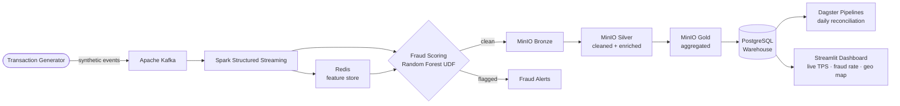

# PaymentPulse

A real-time payment transaction analytics and fraud detection platform simulating an Egyptian fintech payment network — processing high-volume events across 15 service types and 15 governorates, with inline ML fraud scoring before data ever reaches storage.

---

## What this does

Most fraud detection systems score transactions *after* they're stored. PaymentPulse puts the model *inside the stream* — every transaction is validated, enriched, and scored by a Random Forest classifier served as a PySpark UDF before it hits the Bronze layer. Suspicious events are flagged in real time and surfaced on a live Streamlit dashboard showing TPS, fraud rate, and geographic revenue breakdown by governorate.

The platform is structured around the Medallion Architecture on MinIO (Bronze → Silver → Gold), with a PostgreSQL warehouse downstream and Dagster handling daily merchant reconciliation and governorate-level aggregation.

---

## Architecture

### Mermaid diagram



### ASCII diagram

```
 ┌─────────────────────┐
 │ Transaction          │
 │ Generator            │  synthetic events
 └──────────┬──────────┘
            │
            ▼
 ┌─────────────────────┐
 │   Apache Kafka       │  event streaming
 └──────────┬──────────┘
            │
            ▼
 ┌─────────────────────┐     ┌──────────────────┐
 │  Spark Structured    │────▶│  Redis           │
 │  Streaming           │◀────│  feature store   │
 └──────────┬──────────┘     └──────────────────┘
            │
            ▼
 ┌─────────────────────┐
 │  Random Forest UDF   │  fraud scoring inline
 └──────┬──────┬───────┘
        │      │
   clean│      │flagged
        ▼      ▼
 ┌──────────┐ ┌──────────────┐
 │  MinIO   │ │ Fraud Alerts │
 │  Bronze  │ └──────────────┘
 └────┬─────┘
      │
      ▼
 ┌──────────┐
 │  MinIO   │  cleaned + enriched
 │  Silver  │
 └────┬─────┘
      │
      ▼
 ┌──────────┐
 │  MinIO   │  aggregated KPIs
 │  Gold    │
 └────┬─────┘
      │
      ▼
 ┌──────────────────┐
 │  PostgreSQL      │  data warehouse
 │  Warehouse       │
 └────┬─────────────┘
      │
      ├──────────────────────────────┐
      ▼                              ▼
 ┌──────────────────┐     ┌──────────────────────┐
 │  Dagster          │     │  Streamlit Dashboard │
 │  daily pipelines  │     │  TPS · fraud · geo   │
 └──────────────────┘     └──────────────────────┘
```

---

## Stack

| Layer | Technology | Role |
|---|---|---|
| Ingestion | Apache Kafka | Real-time event streaming |
| Processing | Apache Spark (Structured Streaming) | Stream processing + ML scoring |
| ML | scikit-learn Random Forest → PySpark UDF | Inline fraud detection |
| Feature store | Redis | Low-latency feature lookups |
| Data lake | MinIO (S3-compatible) | Bronze / Silver / Gold layers |
| Warehouse | PostgreSQL | Analytical aggregates |
| Orchestration | Dagster | Scheduled reconciliation pipelines |
| Dashboard | Streamlit | Live KPI visualization |
| Infrastructure | Docker (12 services) | Full platform containerization |

---

## Key design decisions

**Why fraud scoring inside the stream?**
Scoring after storage means fraudulent transactions are already persisted and require retroactive correction. By serving the Random Forest model as a PySpark UDF inside the Spark Structured Streaming job, suspicious events are flagged before they touch the Bronze layer — cleaner audit trail, no retroactive patching.

**Why Redis as a feature store?**
Transaction fraud signals (e.g. velocity per merchant, per governorate) require state that can't be derived from a single event. Redis holds pre-aggregated rolling windows that the UDF can look up at stream speed without hitting the data lake.

**Why Dagster over Airflow for batch?**
Dagster's asset-based model maps naturally to Medallion layers — each layer is an explicit asset with defined dependencies, making lineage and impact analysis first-class rather than inferred from task graphs.

---

## Project structure

```
paymentpulse/
├── producer/           # Kafka transaction generator
├── spark_streaming/    # Spark job + Random Forest UDF
├── dagster_pipelines/  # Daily reconciliation + aggregation
├── dashboard/          # Streamlit app
├── models/             # Trained fraud model (pickle)
├── docker/             # Docker Compose + service configs
└── notebooks/          # EDA and model training
```

---

## Running locally

**Prerequisites:** Docker, Docker Compose

```bash
git clone https://github.com/mahmoudnasser-97/paymentpulse
cd paymentpulse
docker compose up --build
```

Services start in order with health checks. The Streamlit dashboard is available at `http://localhost:8501` once all services are healthy (~2–3 min cold start).

| Service | URL |
|---|---|
| Streamlit dashboard | http://localhost:8501 |
| Airflow (if applicable) | http://localhost:8080 |
| MinIO console | http://localhost:9001 |

---

## Domain context

The platform is modelled on Egyptian payment network patterns — 15 governorates, 15 service categories (mobile top-up, utilities, e-commerce, etc.) — to reflect realistic fraud monitoring challenges at the scale of providers like Fawry or Paymob. Transaction volumes and fraud rates are calibrated to mirror production-like distributions rather than uniform random data.

---

## Author

Mahmoud Nasser Elmoghany
[LinkedIn](https://linkedin.com/in/mahmoud-elmoghany) · [GitHub](https://github.com/mahmoudnasser-97)
